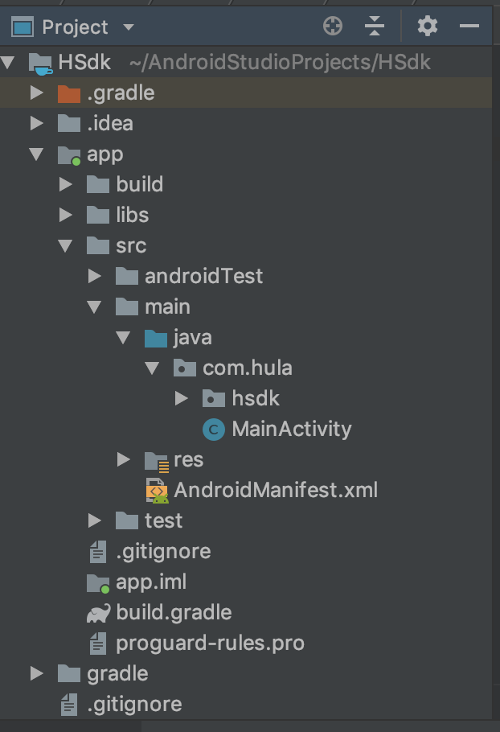

# 入门指南

### 前提条件 <a id="prerequisites"></a>

* 使用 Android Studio 1.0 或更高版本
* 定位到 Android API 级别 14 或更高级别

### 导入移动广告 SDK <a id="import_the_mobile_ads_sdk"></a>

通过使用指向 Google Maven 代码库的 [Gradle](https://gradle.org/) 依赖项，应用可以导入 Google 移动广告 SDK。要使用该代码库，您需要在应用的项目级 `build.gradle` 文件中对其进行引用。请打开该文件，并找到 `allprojects` 部分：

#### 项目级 build.gradle 示例（节选） <a id="example_project-level_buildgradle_excerpt"></a>

```text
allprojects {
    repositories {
        google()
        jcenter()
    }
}
```

如果上面的 `google()` 指令不存在，请添加该指令。

接下来，请打开您应用的应用级 `build.gradle` 文件，并找到“dependencies”部分。

#### 应用级 build.gradle 示例（节选） <a id="example_app-level_buildgradle_excerpt"></a>

```text
implementation 'com.facebook.android:audience-network-sdk:5.1.1'
implementation 'com.facebook.android:facebook-core:[4,5]'

implementation 'com.appsflyer:af-android-sdk:4.9.0@aar'
implementation 'com.android.installreferrer:installreferrer:1.0'

implementation 'com.google.android.gms:play-services-ads:17.2.0'
```

请添加上面的代码行，该代码会指示 Gradle 提取最新版本的移动广告 SDK。添加完该代码后，请保存文件并执行“Gradle sync”

### 导入hsdk包源码到src代码目录下



### 更新您的 AndroidManifest.xml <a id="update_your_androidmanifestxml"></a>

通过添加下面显示的 `<meta-data>` 标记，即可将您的 AdMob [应用 ID](https://support.google.com/admob/answer/6232340) 添加到您的应用的 `AndroidManifest.xml` 文件中。您可以在 AdMob 界面中找到您的应用 ID。对于 `android:value`，请插入 AdMob 应用 ID 并加上引号，如下所示。

```text
<manifest>
    <application>
        <!-- Sample AdMob App ID: ca-app-pub-3940256099942544~3347511713 -->
        <meta-data
            android:name="com.google.android.gms.ads.APPLICATION_ID"
            android:value="YOUR_ADMOB_APP_ID"/>
    </application>
</manifest>
```

**添加Facebook的应用id**

```text
<meta-data android:name="com.facebook.sdk.ApplicationId" 
           android:value="@string/facebook_app_id"/>
```

_**facebook\_app\_id需在res目录下 string文件中声明，具体请参考string文件更新**_

**添加appsflyer receiver**

```text
<manifest>
    <application>
        <!-- Sample AdMob App ID: ca-app-pub-3940256099942544~3347511713 -->
        <meta-data
            android:name="com.google.android.gms.ads.APPLICATION_ID"
            android:value="YOUR_ADMOB_APP_ID"/>
    <receiver android:name="com.appsflyer.MultipleInstallBroadcastReceiver" android:exported="true">
    <intent-filter>
        <action android:name="com.android.vending.INSTALL_REFERRER" />
    </intent-filter>
    </receiver>
    </application>
</manifest>
```

### 更新res目录下 string文件


```markup
<resources>
    <string name="facebook_app_id">652302905240772</string>
    <string name="admob_interstitial">ca-app-pub-3940256099942544/1033173712</string>
    <string name="admob_banner">ca-app-pub-3940256099942544/6300978111</string>
    <string name="facebook_interstitial">YOUR_PLACEMENT_ID</string>
    <string name="facebook_banner">YOUR_PLACEMENT_ID</string>
</resources>
```

### **替换AdManager中广告id**

替换数组中的广告id按照Top-High.....Auto顺序填写


```java
 private String[] fbIds = {"YOUR_PLACEMENT_ID", "YOUR_PLACEMENT_ID"};
 private String[] mobIds = {"ca-app-pub-3940256099942544/5224354917"};
```


